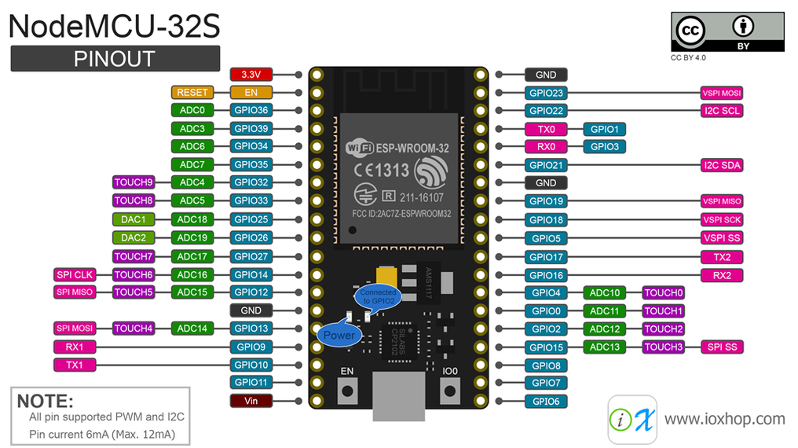

# zephyr-extensa-examples

Small programs to learn the Zephyr RTOS.

## Board

The programs are made for the NodeMCU-32S

### Set boot to download mode

## List of programs

* [helloworld](01-helloworld/)
* [blinky](02-blinky/)

## License

[MIT](LICENSE)
